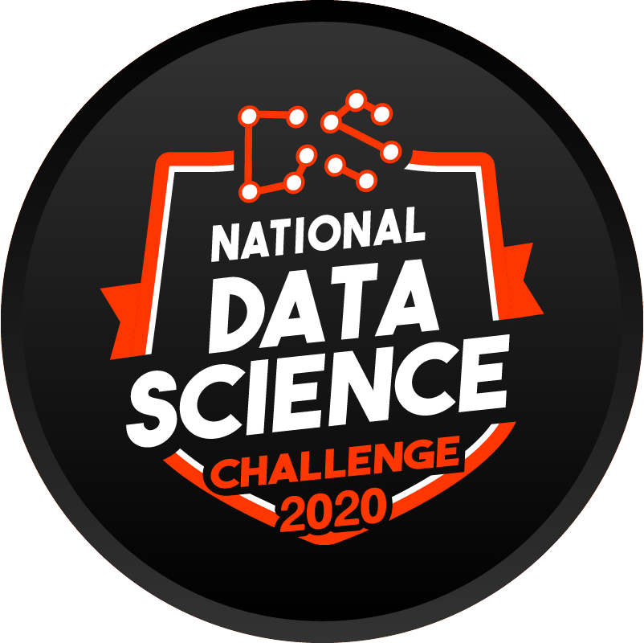
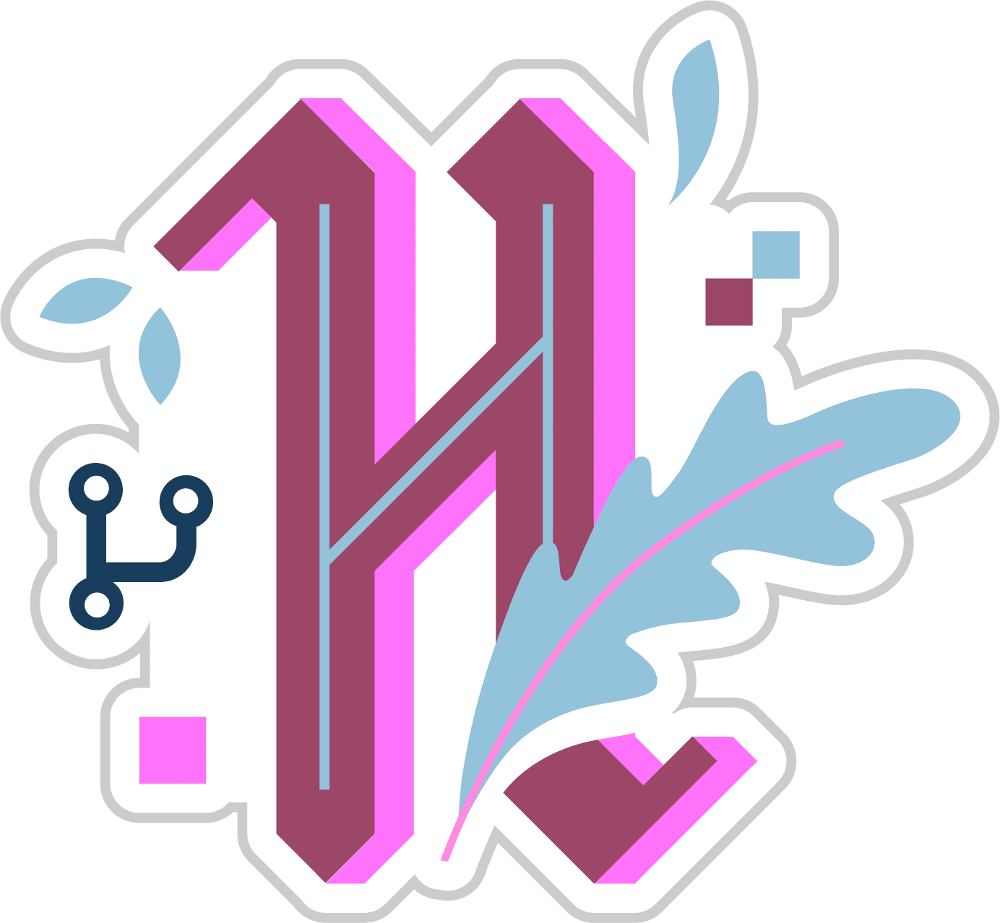

# :wave: :nerd_face: Halo !

:page_facing_up: **[My Personal Website](https://philippurwoko.github.io/)**

## :trophy: Sertifikat
- [Data Analysis with Python](https://freecodecamp.org/certification/philippurwoko/data-analysis-with-python-v7) - Freecodecamp (8 Agustus 2020)
- [Dasar Visualisasi Data](https://www.dicoding.com/users/563914/academies) - Dicoding (23 Juni 2020 - 23 Juni 2023)
- Submisi Single Page Application - [Code Highlighter](https://code-highlighter.vercel.app) - Departement Riset dan Teknologi Himpunan Mahasiswa Teknik Informatika PENS (4 Oktober 2020)

### :newspaper: Artikel Terbaru
- [Menggunakan Artificial Intelligence Untuk Mendeteksi Pemakaian Masker](https://medium.com/easyread/menggunakan-artificial-intelligence-untuk-mendeteksi-pemakaian-masker-b0564732c4ee)
- [Caraku Mempelajari Vue js dan Vuex Dalam 14 Hari](https://medium.com/easyread/caraku-mempelajari-vue-js-dan-vuex-dalam-14-hari-9b013361af88)
- [Membuat Proyek Machine Learning dengan Python — Part 2](https://medium.com/easyread/membuat-proyek-machine-learning-dengan-python-part-2-5a3b33d6aca6)

### :tv: Sosial Media 

    &nbsp;&nbsp;
    &nbsp;&nbsp;
	&nbsp;&nbsp;
    &nbsp;&nbsp;
    &nbsp;&nbsp;
    &nbsp;&nbsp;
    

### :heart_decoration: Swag

    &nbsp;&nbsp;
    &nbsp;&nbsp;
    &nbsp;&nbsp;
    &nbsp;&nbsp;
    

